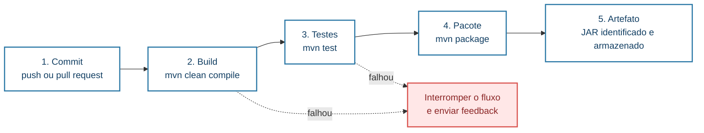
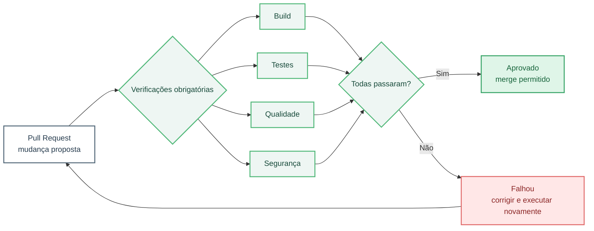

# Aula 09 — DevOps: Cultura, Automação e Pipelines

**Cloud Computing e DevOps Avançado**  
CST em Sistemas para Internet | 6º Período

---

## Slide 1: Abertura

### Aula 09 — DevOps: da Colaboração ao Pipeline

- Primeira aula do segundo bimestre
- Cultura DevOps
- Automação de processos
- Visão geral de integração e entrega contínuas
- Professor Ranghetti

---

## Slide 2: Objetivos da Aula

### Ao final desta aula você será capaz de

- Explicar DevOps como cultura e sistema de trabalho
- Relacionar desenvolvimento, operações, segurança e negócio
- Identificar desperdícios em um fluxo de entrega de software
- Diferenciar integração contínua, entrega contínua e implantação contínua
- Reconhecer as etapas essenciais de um pipeline
- Avaliar riscos, feedback e critérios de passagem entre etapas
- Modelar um pipeline para uma aplicação web

---

## Slide 3: Agenda

- Ajuste do cronograma do segundo bimestre
- Retomada do primeiro bimestre
- Cultura e princípios DevOps
- Fluxo de valor e colaboração
- Automação e feedback
- CI, entrega contínua e implantação contínua
- Anatomia de um pipeline
- Segurança e rastreabilidade desde o início
- Atividade prática: modelagem de pipeline
- Lançamento do Trabalho 5
- Glossário, referências e fechamento

---

## Slide 4: Ajuste do Calendário

- Na próxima semana ocorrerá a Jornada Acadêmica
- Não haverá aula regular da disciplina nessa semana
- O segundo bimestre terá:
  - Seis aulas regulares em vez de sete
- O ajuste preserva:
  - Conteúdos do plano de ensino
  - Quatro trabalhos do bimestre
  - Atividades práticas
  - Aula final de revisão
- Temas relacionados serão integrados para evitar perda de conteúdo

---

## Slide 5: Cronograma Ajustado do Segundo Bimestre

| Aula | Conteúdo principal |
|---:|---|
| 09 | Cultura DevOps, automação e visão geral de pipelines |
| 10 | Integração contínua: ferramentas e implementação |
| 11 | Entrega contínua, estratégias de deploy e fundamentos de observabilidade |
| 12 | Observabilidade aplicada, alta disponibilidade, resiliência e recuperação de desastres |
| 13 | Segurança, DevSecOps, Zero Trust e FinOps |
| 14 | Revisão e consolidação do segundo bimestre |

- A Jornada Acadêmica acontece entre as Aulas 09 e 10

---

## Slide 6: Trabalhos do Segundo Bimestre

| Trabalho | Tema | Entrega prevista |
|---|---|---|
| T5 | Pipeline CI mínimo e reprodutível | Aula 10 |
| T6 | Estratégia de CD, deploy e rollback | Aula 12 |
| T7 | Observabilidade: SLIs, SLOs, alertas e painel mínimo | Aula 12 |
| T8 | Segurança, DevSecOps e FinOps aplicados | Aula 13 |

- Cada trabalho vale até 1,0 ponto
- Total dos trabalhos: até 4,0 pontos

---

## Slide 7: Conexão com o Primeiro Bimestre

- Aplicações em nuvem
- Arquiteturas distribuídas e escaláveis
- Microserviços
- Containers e imagens
- Kubernetes
- Configuração, Secrets e verificações de saúde
- Implantação em diferentes provedores
- Comparação de custos e esforço operacional

### Nova pergunta

Como transformar código em uma entrega frequente, segura, repetível e observável?

---

## Slide 8: O Problema Antes do DevOps

- Desenvolvimento cria mudanças
- Operações busca estabilidade
- Segurança controla riscos
- Negócio deseja velocidade e valor
- Quando esses objetivos são tratados isoladamente:
  - Entregas ficam lentas
  - Informações chegam tarde
  - Erros passam de uma equipe para outra
  - Responsabilidades tornam-se disputas
  - Implantação vira evento de alto risco

---

## Slide 9: DevOps Não É Apenas uma Ferramenta

- DevOps não é sinônimo de:
  - Docker
  - Kubernetes
  - Jenkins
  - GitHub Actions
  - “Equipe DevOps” responsável por tudo
- Ferramentas podem apoiar o trabalho
- A transformação depende de:
  - Cultura
  - Colaboração
  - Fluxo
  - Automação
  - Medição
  - Aprendizado

---

## Slide 10: Uma Definição Operacional de DevOps

- Conjunto de princípios e práticas para aproximar:
  - Desenvolvimento
  - Operações
  - Segurança
  - Qualidade
  - Negócio
- Busca melhorar o fluxo de mudanças desde a ideia até a operação
- Procura entregar com:
  - Frequência
  - Qualidade
  - Segurança
  - Feedback rápido
  - Responsabilidade compartilhada

---

## Slide 11: Objetivos que Precisam Coexistir

| Objetivo | Risco quando isolado |
|---|---|
| Velocidade | Entregar rapidamente sem qualidade ou controle |
| Estabilidade | Evitar mudanças e atrasar valor necessário |
| Segurança | Criar aprovações tardias e filas extensas |
| Custo | Economizar recursos e comprometer resiliência |
| Inovação | Experimentar sem observar impacto operacional |

- DevOps procura equilibrar objetivos no mesmo sistema de trabalho

---

## Slide 12: Cultura DevOps

- Responsabilidade compartilhada pelo resultado
- Comunicação entre funções
- Transparência sobre riscos e falhas
- Aprendizado em vez de busca automática por culpados
- Preferência por mudanças pequenas e frequentes
- Automação do trabalho repetitivo
- Feedback rápido do código e da produção
- Melhoria contínua orientada por evidências

---

## Slide 13: Colaboração além dos Silos

- Silo:
  - Grupo que trabalha com pouca visibilidade ou cooperação com os demais
- Sintomas:
  - “Na minha máquina funciona”
  - Chamados sem contexto
  - Segurança consultada somente antes da entrega
  - Operações recebe um pacote desconhecido
  - Desenvolvimento não acompanha produção
- DevOps reduz barreiras por meio de objetivos, práticas e informações compartilhadas

---

## Slide 14: Responsabilidade Compartilhada

- Desenvolvimento considera:
  - Operação
  - Segurança
  - Observabilidade
  - Custos
- Operações participa de:
  - Arquitetura
  - Automação
  - Definição de requisitos operacionais
- Segurança contribui desde o início
- Todos colaboram para:
  - Entrega
  - Disponibilidade
  - Recuperação
  - Aprendizado com incidentes

---

## Slide 15: As Três Formas — Visão Geral

- Fluxo:
  - Acelerar o caminho da mudança até o usuário
- Feedback:
  - Fazer informação retornar rapidamente
- Aprendizado e experimentação:
  - Melhorar o sistema com prática, evidências e segurança
- As três dimensões se reforçam
- Automatizar sem melhorar fluxo e feedback pode apenas acelerar problemas existentes

---

## Slide 16: Primeira Forma — Fluxo

- Visualizar o caminho completo
- Reduzir lotes de mudança
- Diminuir filas e esperas
- Automatizar etapas repetitivas
- Evitar retrabalho
- Manter trabalho em progresso sob controle
- Tornar dependências explícitas
- Objetivo:
  - Fazer valor avançar com qualidade até a operação

---

## Slide 17: Segunda Forma — Feedback

- Testes fornecem feedback sobre comportamento
- Análise estática fornece feedback sobre código
- Pipeline informa o estado da mudança
- Monitoramento mostra o comportamento em execução
- Usuários e stakeholders validam valor
- Feedback deve ser:
  - Rápido
  - Confiável
  - Compreensível
  - Acionável

---

## Slide 18: Terceira Forma — Aprendizado

- Experimentar mudanças pequenas
- Aprender com falhas sem ocultá-las
- Realizar retrospectivas e análises de incidentes
- Melhorar documentação e automação após problemas
- Criar ambientes seguros para praticar recuperação
- Compartilhar conhecimento
- Aprendizado precisa alterar o sistema, não apenas gerar um relatório

---

## Slide 19: Fluxo de Valor de Software

- Caminho desde uma necessidade até o resultado em produção
- Pode incluir:
  - Ideia
  - Priorização
  - Desenvolvimento
  - Revisão
  - Testes
  - Build
  - Segurança
  - Aprovação
  - Deploy
  - Operação e feedback
- Otimizar apenas uma etapa pode não melhorar o tempo total

---

## Slide 20: Tempo Ativo e Tempo de Espera

- Tempo ativo:
  - Alguém ou algum sistema está processando a mudança
- Tempo de espera:
  - A mudança aguarda pessoa, ambiente, aprovação ou recurso
- Em muitos fluxos:
  - Esperas superam o tempo de execução
- Exemplos:
  - Aguardar revisão
  - Aguardar ambiente
  - Aguardar janela de deploy
  - Aguardar investigação após falha

---

## Slide 21: Mapeamento do Fluxo de Valor

- Para cada etapa, registrar:
  - Entrada
  - Saída
  - Responsável atual
  - Tempo ativo
  - Tempo de espera
  - Taxa de erro ou retrabalho
  - Dependências
- Perguntas:
  - Onde a mudança permanece parada?
  - Onde defeitos são descobertos?
  - Qual etapa exige trabalho manual repetitivo?

---

## Slide 22: Automação com Propósito

- Automatizar tarefas:
  - Repetitivas
  - Frequentes
  - Sujeitas a erro humano
  - Que precisam de consistência
- Exemplos:
  - Compilação
  - Testes
  - Análise de código
  - Construção de imagem
  - Publicação de artefato
  - Implantação
- Primeiro compreender o processo; depois automatizar

---

## Slide 23: O Que Não Automatizar Imediatamente

- Processo instável ou não compreendido
- Decisão que exige julgamento ainda não modelado
- Etapa rara cujo custo de automação supera o benefício
- Atividade com risco alto e controles insuficientes
- Processo ruim não se torna bom apenas porque ficou automático
- Estratégia:
  - Simplificar
  - Padronizar
  - Automatizar
  - Medir
  - Melhorar

---

## Slide 24: Infraestrutura e Configuração Reproduzíveis

- Ambientes criados manualmente tendem a divergir
- Reprodutibilidade pode ser apoiada por:
  - Scripts
  - Imagens de container
  - Manifestos Kubernetes
  - Infraestrutura como código
  - Configuração versionada
- Benefícios:
  - Menos diferenças entre ambientes
  - Revisão de mudanças
  - Recuperação mais previsível
  - Histórico e rastreabilidade

---

## Slide 25: O Que É um Pipeline?

- Sequência automatizada de etapas que transforma uma mudança em um resultado verificável
- Pode começar com:
  - Commit
  - Pull request
  - Tag
  - Agendamento
  - Ação manual autorizada
- Pode produzir:
  - Relatórios
  - Pacotes
  - Imagens
  - Releases
  - Implantações
- O pipeline representa políticas executáveis do processo de entrega

---

## Slide 26: Pipeline Não É Apenas uma Lista de Comandos

- Um pipeline deve comunicar:
  - O que inicia a execução
  - Quais verificações são realizadas
  - Que artefato é produzido
  - Que condições interrompem o fluxo
  - Onde existem aprovações
  - Como promover entre ambientes
  - Como rastrear a versão
- Um pipeline bem definido reduz conhecimento implícito

---

## Slide 27: CI — Integração Contínua

- Prática de integrar mudanças pequenas e frequentes
- Cada integração deve ser verificada
- Verificações típicas:
  - Compilação
  - Testes automatizados
  - Análise de qualidade
  - Validações de segurança
- Objetivo:
  - Descobrir problemas cedo
  - Manter a base de código em estado conhecido

---

## Slide 28: Condições para uma CI Saudável

- Código em controle de versão
- Mudanças integradas com frequência
- Build automatizado
- Testes confiáveis
- Resultado visível para a equipe
- Falha tratada rapidamente
- Execução com duração compatível com feedback rápido
- Artefatos identificáveis
- Processo reproduzível fora da máquina de uma única pessoa

---

## Slide 29: Entrega Contínua

- Continuous Delivery
- Mudanças aprovadas permanecem prontas para implantação
- Deploy em produção pode exigir decisão ou aprovação explícita
- Exige:
  - Artefato confiável
  - Ambientes consistentes
  - Testes adequados
  - Processo de deploy reproduzível
  - Estratégia de recuperação
- “Contínua” indica capacidade frequente, não obrigação de publicar toda mudança

---

## Slide 30: Implantação Contínua

- Continuous Deployment
- Toda mudança que passa pelas verificações é implantada automaticamente em produção
- Exige maturidade elevada em:
  - Automação
  - Testes
  - Observabilidade
  - Segurança
  - Recuperação
- Não é requisito para afirmar que uma equipe pratica DevOps
- A escolha depende do risco e do contexto

---

## Slide 31: CI, Entrega e Implantação Contínuas

| Conceito | Resultado esperado |
|---|---|
| Integração contínua | Mudança integrada e verificada frequentemente |
| Entrega contínua | Artefato validado e pronto para produção |
| Implantação contínua | Mudança validada implantada automaticamente em produção |

- Os termos representam capacidades diferentes
- Confundi-los pode gerar expectativa incorreta sobre o processo

---

## Slide 32: Pipeline de Referência

```text
Commit / Pull Request
        ↓
Validação de código
        ↓
Build
        ↓
Testes automatizados
        ↓
Verificações de segurança
        ↓
Empacotamento e publicação do artefato
        ↓
Deploy em ambiente de teste
        ↓
Validações adicionais
        ↓
Promoção controlada para produção
```

---

## Slide 33: Etapa 1 — Gatilho e Checkout

- Gatilhos possíveis:
  - Push em branch
  - Pull request
  - Tag de versão
  - Execução manual
- Checkout:
  - Obtém a versão exata do código
- Cuidados:
  - Não executar deploy de produção para qualquer branch
  - Registrar commit e origem da execução
  - Restringir eventos sensíveis

---

## Slide 34: Etapa 2 — Validação Inicial

- Verificar estrutura e arquivos obrigatórios
- Formatação ou lint, quando aplicável
- Dependências declaradas
- Segredos expostos acidentalmente
- Convenções do projeto
- Objetivo:
  - Rejeitar rapidamente problemas simples
- Falhar cedo economiza recursos das etapas posteriores

---

## Slide 35: Etapa 3 — Build

- Compilar ou empacotar a aplicação
- Resolver dependências de forma controlada
- Registrar versões utilizadas
- Produzir saída determinística quando possível
- Para aplicação Java com Maven:
  - Baixar dependências
  - Compilar
  - Executar fases configuradas
  - Gerar pacote, como arquivo JAR
- Falha de build interrompe o pipeline

---

## Slide 36: Etapa 4 — Testes Automatizados

- Testes unitários
- Testes de integração, quando disponíveis
- Testes de contrato ou API, conforme o projeto
- Objetivo:
  - Verificar comportamento esperado
- Cuidados:
  - Testes instáveis reduzem confiança
  - Testes lentos atrasam feedback
  - Ausência de testes não deve ser escondida pelo pipeline

---

## Slide 37: Etapa 5 — Qualidade e Segurança

- Análise estática
- Verificação de dependências vulneráveis
- Detecção de segredos
- Revisão de configuração
- Políticas mínimas de qualidade
- Segurança deve ocorrer em múltiplos pontos
- Resultado precisa ser:
  - Visível
  - Priorizado por risco
  - Tratado com responsável e prazo

---

## Slide 38: Etapa 6 — Artefato

- Resultado versionado do build
- Exemplos:
  - JAR
  - Pacote compactado
  - Imagem de container
- Boas práticas:
  - Identificador único
  - Associação com commit
  - Armazenamento em repositório ou registro
  - Imutabilidade
  - Metadados de criação
- O mesmo artefato deve ser promovido entre ambientes

---

## Slide 39: Artefato Imutável

- Evitar recompilar separadamente para cada ambiente
- Estratégia:
  - Construir uma vez
  - Testar
  - Publicar
  - Promover o mesmo artefato
- Configurações variáveis ficam externas ao artefato
- Benefícios:
  - Reduz diferenças
  - Melhora rastreabilidade
  - Facilita rollback

---

## Slide 40: Etapa 7 — Deploy em Ambiente de Teste

- Implantar automaticamente ou sob controle definido
- Aplicar configuração do ambiente
- Validar disponibilidade inicial
- Executar smoke tests
- Coletar logs e resultados
- Interromper promoção se critérios falharem
- O ambiente precisa representar riscos relevantes da produção

---

## Slide 41: Promoção para Produção

- Decisão baseada em evidências
- Pode incluir:
  - Aprovação
  - Janela de mudança
  - Critérios de qualidade
  - Verificação de segurança
  - Plano de rollback
- Produção não deve receber artefato diferente do validado
- Na Aula 11:
  - Blue/green
  - Canary
  - Rollback

---

## Slide 42: Ambientes no Fluxo

| Ambiente | Finalidade possível |
|---|---|
| Desenvolvimento | Feedback local e rápido |
| Integração | Verificar interação entre componentes |
| Homologação | Validar cenário próximo da produção |
| Produção | Entregar valor ao usuário |

- Quantidade e nomes variam conforme o contexto
- Mais ambientes não garantem mais qualidade
- Cada ambiente deve ter finalidade, política e responsável claros

---

## Slide 43: Configuração e Segredos

- Configuração depende do ambiente
- Segredos não devem estar:
  - No código
  - Na imagem
  - No arquivo público do pipeline
  - Em logs
- Usar mecanismos protegidos da plataforma
- Aplicar menor privilégio às credenciais
- Separar:
  - Artefato
  - Configuração
  - Segredo

---

## Slide 44: Falhar Rápido e com Clareza

- Uma falha deve informar:
  - Etapa
  - Comando ou verificação
  - Motivo relevante
  - Evidência ou log
- Evitar:
  - Mensagem genérica
  - Pipeline que continua após erro crítico
  - Ocultar falha para manter indicador “verde”
- Pipeline confiável interrompe o fluxo quando uma condição obrigatória não é atendida

---

## Slide 45: Feedback do Pipeline

- Status visível no repositório
- Logs acessíveis
- Relatórios de testes
- Resultado de qualidade e segurança
- Associação com commit ou pull request
- Notificação para pessoas responsáveis
- Feedback excessivo e sem prioridade vira ruído
- Cada alerta deve indicar uma ação possível

---

## Slide 46: Rastreabilidade

- Responder:
  - Qual código gerou este artefato?
  - Qual pipeline realizou o build?
  - Que testes foram executados?
  - Quem aprovou a promoção?
  - Qual versão está em produção?
  - Quando ocorreu a implantação?
- Rastreabilidade apoia:
  - Auditoria
  - Diagnóstico
  - Rollback
  - Segurança

---

## Slide 47: Métricas de Entrega — Introdução

- Frequência de implantação
- Tempo entre mudança e produção
- Taxa de falha de mudanças
- Tempo de recuperação
- Métricas devem avaliar o sistema de entrega
- Não usar números isolados para competir entre pessoas ou equipes
- Na disciplina:
  - Serão relacionadas a deploy, observabilidade, resiliência e melhoria

---

## Slide 48: Segurança no Pipeline

- Controlar permissões do executor
- Proteger variáveis e credenciais
- Fixar origem de dependências e ações quando aplicável
- Revisar mudanças no pipeline
- Separar permissões por ambiente
- Manter registros de execução
- Atualizar componentes do pipeline
- DevSecOps será aprofundado na Aula 13

---

## Slide 49: Erros Comuns em Pipelines

- Build funciona apenas na máquina do desenvolvedor
- Testes são ignorados para acelerar entrega
- Credenciais aparecem em texto puro
- Cada ambiente recebe artefato recompilado
- Versões usam somente uma tag genérica
- Falhas não interrompem etapas seguintes
- Deploy não possui rollback
- Pipeline depende de muitos passos manuais não documentados
- Logs não permitem identificar o erro

---

## Slide 50: Exemplos Práticos de CI

- Exemplo 1:
  - Compilar, testar e empacotar uma aplicação Java com Maven
- Exemplo 2:
  - Usar o pipeline como porta de qualidade de um pull request
- Exemplo 3:
  - Construir, identificar e publicar uma imagem Docker
- Nos três exemplos:
  - A execução parte de uma versão conhecida do código
  - Falhas interrompem o processo
  - Evidências ficam disponíveis para a equipe

---

## Slide 51: Exemplo 1 — CI para Java e Maven



- Fluxo mínimo:
  - Obter o código
  - Configurar a versão correta do Java
  - Compilar
  - Executar testes
  - Empacotar o JAR
  - Armazenar o artefato
- Se compilação ou testes falharem, o artefato não deve ser publicado

---

## Slide 52: Exemplo 1 — Comandos e Evidências

### Sequência conceitual

```bash
mvn --batch-mode clean test
mvn --batch-mode package
```

- Evidências esperadas:
  - Log da compilação
  - Quantidade de testes executados
  - Resultado dos testes
  - Arquivo JAR produzido em `target/`
  - Identificação do commit da execução
- Exercício:
  - Alterar um teste para falhar e observar em qual etapa o pipeline para

---

## Slide 53: Exemplo 2 — Pull Request com Porta de Qualidade



- Ao abrir ou atualizar um pull request:
  - O pipeline executa automaticamente
  - Build, testes, qualidade e segurança produzem status
- Política possível:
  - Merge permitido apenas quando verificações obrigatórias passam
- Benefício:
  - Problemas são corrigidos antes de chegar à branch principal

---

## Slide 54: Exemplo 2 — Cenário de Falha

- Mudança proposta:
  - Alteração no cálculo de empréstimo de livro
- O pipeline detecta:
  - Um teste que esperava prazo diferente
- A equipe deve:
  1. Abrir o log da etapa de testes
  2. Identificar teste e comportamento divergente
  3. Corrigir código ou teste conforme o requisito
  4. Enviar novo commit
  5. Aguardar nova verificação
- Não é necessário executar o merge para descobrir o problema

---

## Slide 55: Exemplo 3 — Imagem Docker Publicada pelo CI

```mermaid
flowchart LR
    A["Código<br/>commit a1b2c3d"] --> B["Testes aprovados"]
    B --> C["Docker build<br/>Dockerfile reproduzível"]
    C --> D["Imagem<br/>biblioteca:a1b2c3d"]
    D --> E["Autenticação<br/>credencial protegida"]
    E --> F["Registro<br/>imagem publicada"]
    F --> G["Deploy posterior<br/>promove a mesma imagem"]

    classDef etapa fill:#ffffff,stroke:#2ca9b0,stroke-width:2px,color:#0c5160;
    classDef destino fill:#d7f3f3,stroke:#2ca9b0,stroke-width:3px,color:#0c5160;
    class A,B,C,D,E etapa;
    class F,G destino;
```



- Após build e testes aprovados:
  - Construir a imagem a partir do `Dockerfile`
  - Identificar a imagem com tag rastreável
  - Autenticar no registro usando credencial protegida
  - Publicar a imagem
- Exemplo de identificação:
  - `biblioteca:a1b2c3d`
- O deploy deve reutilizar essa mesma imagem, sem recompilação

---

## Slide 56: Caso da Aplicação Biblioteca

- Código-fonte em repositório
- Projeto Java com Maven
- Possibilidade de gerar pacote JAR
- Aplicação containerizada no primeiro bimestre
- Imagem pode ser publicada em registro
- Kubernetes pode executar o workload
- Desafio:
  - Definir um pipeline que verifique o código e produza um artefato rastreável

---

## Slide 57: Atividade Prática — Contexto

- Equipes de 3–5 alunos
- Tempo sugerido: 35–45 minutos
- Produto:
  - Aplicação Biblioteca ou projeto equivalente autorizado
- Situação:
  - Builds são realizados manualmente
  - Erros aparecem durante o deploy
  - Não existe evidência única de testes
  - Imagens recebem nomes inconsistentes
- Objetivo:
  - Modelar um fluxo automatizado e verificável

---

## Slide 58: Atividade Prática — Desenhar o Pipeline

- Definir:
  1. Gatilho
  2. Checkout
  3. Validação inicial
  4. Build
  5. Testes
  6. Verificação de qualidade e segurança
  7. Artefato produzido
  8. Publicação
  9. Deploy de teste
  10. Critério para promoção
- Representar etapas e dependências em um diagrama

---

## Slide 59: Atividade Prática — Detalhar Cada Etapa

| Campo | Pergunta |
|---|---|
| Entrada | O que a etapa recebe? |
| Ação | O que será executado? |
| Saída | Que resultado será produzido? |
| Falha | Que condição interrompe o pipeline? |
| Evidência | Que log, relatório ou artefato ficará disponível? |
| Responsabilidade | Quem responde quando a etapa falha? |

---

## Slide 60: Atividade Prática — Analisar Riscos

- Identificar pelo menos quatro riscos
- Exemplos:
  - Testes insuficientes
  - Dependência indisponível
  - Segredo exposto
  - Imagem sem versão única
  - Executor com permissão excessiva
  - Falha de publicação
  - Ambiente de teste diferente da produção
- Propor uma mitigação para cada risco

---

## Slide 61: Atividade Prática — Apresentação

- Cada grupo apresenta em até 4 minutos:
  - Gatilho
  - Etapas
  - Artefato
  - Condições de falha
  - Evidências geradas
  - Principal risco e mitigação
- Pergunta para a turma:
  - Em qual ponto um defeito seria descoberto?
  - O feedback chegaria cedo o suficiente?

---

## Slide 62: Trabalho 5 — Lançamento

- Tema:
  - Pipeline CI mínimo e reprodutível
- Valor:
  - Até 1,0 ponto
- Equipes:
  - Conforme organização definida pelo professor
- Entrega:
  - Aula 10, após a semana da Jornada Acadêmica
- Ferramenta:
  - Jenkins, GitLab CI, GitHub Actions ou outra autorizada

---

## Slide 63: T5 — Objetivo

- Implementar um pipeline que possa ser repetido a partir do repositório
- O pipeline deve:
  - Ser iniciado por evento definido
  - Obter o código correto
  - Executar build
  - Executar testes disponíveis
  - Interromper em caso de falha
  - Produzir ou identificar um artefato
  - Manter evidências de execução
- A Aula 10 aprofundará configuração e ferramentas de CI

---

## Slide 64: T5 — Entregáveis

- Repositório da equipe
- Arquivo de definição do pipeline
- Instruções para execução
- Identificação de:
  - Gatilho
  - Etapas
  - Dependências
  - Artefato
- Evidência de execução bem-sucedida
- Evidência de uma falha detectada
- Breve explicação sobre:
  - Como reproduzir
  - Como investigar falhas
  - Como os segredos são protegidos

---

## Slide 65: T5 — Escopo Mínimo

- Obrigatório:
  - Checkout
  - Build
  - Testes existentes
  - Resultado visível
  - Artefato identificado
- Recomendado, quando aplicável:
  - Cache de dependências
  - Análise estática
  - Construção de imagem
  - Detecção de segredos
- Não é obrigatório nesta entrega:
  - Deploy automático em produção
  - Estratégias blue/green ou canary

---

## Slide 66: T5 — Critérios de Avaliação

| Critério | Valor |
|---|---:|
| Pipeline executável e reprodutível |  |
| Build, testes e tratamento de falhas |  |
| Artefato e rastreabilidade |  |
| Evidências e instruções |  |
| Segurança básica e organização |  |
| **Total** | **1,00** |

---

## Slide 67: Checklist do Trabalho 5

- O repositório pode ser acessado pelo professor?
- O pipeline possui um gatilho compreensível?
- O build parte de ambiente limpo?
- Testes são executados?
- Uma falha interrompe corretamente o fluxo?
- O artefato possui identificação?
- A execução pode ser associada ao commit?
- Logs e evidências estão disponíveis?
- Não existem segredos no repositório ou nos logs?
- Outra equipe conseguiria reproduzir o processo?

---

## Slide 68: Glossário — Cultura e Fluxo

| Termo | Significado |
|---|---|
| **DevOps** | Princípios e práticas que integram pessoas, processos e tecnologia para melhorar a entrega e operação de software |
| **Silo** | Separação que reduz colaboração e visibilidade entre grupos |
| **Fluxo de valor** | Caminho da necessidade até o resultado entregue e operado |
| **Feedback** | Informação que retorna ao processo e permite decisão ou correção |
| **Automação** | Execução padronizada de tarefas por ferramentas ou código |
| **Reprodutibilidade** | Capacidade de repetir um processo e obter resultado consistente |

---

## Slide 69: Glossário — Pipeline

| Termo | Significado |
|---|---|
| **Pipeline** | Sequência automatizada de etapas de verificação, build, publicação e entrega |
| **Trigger** | Evento que inicia uma execução |
| **Build** | Processo de compilar ou empacotar a aplicação |
| **Artefato** | Resultado versionado produzido pelo build |
| **Integração contínua** | Integração e verificação frequentes de mudanças pequenas |
| **Entrega contínua** | Capacidade de manter mudanças validadas prontas para produção |
| **Implantação contínua** | Deploy automático em produção após as verificações |

---

## Slide 70: Glossário — Operação e Controle

| Termo | Significado |
|---|---|
| **Rastreabilidade** | Capacidade de relacionar código, execução, artefato, aprovação e deploy |
| **Promoção** | Avanço controlado do mesmo artefato entre ambientes |
| **Smoke test** | Verificação rápida das funções essenciais após uma implantação |
| **Rollback** | Retorno a uma versão ou estado anterior conhecido |
| **Menor privilégio** | Concessão apenas das permissões necessárias |
| **Lead time de mudança** | Tempo entre uma mudança e sua disponibilização no ambiente-alvo |

---

## Slide 71: Referências Bibliográficas

### Bibliografia do plano de ensino

- KOLBE JÚNIOR, Armando. *Computação em Nuvem*. 1. ed. São Paulo: Contentus, 2020.
- SOUSA NETO, Manoel Veras de. *Computação em Nuvem*. 1. ed. Rio de Janeiro: Brasport, 2015.
- MUNIZ, Antonio; IRIGOYEN, Analia. *Jornada DevOps*. 2. ed. Rio de Janeiro: Brasport, 2020.
- FREEMAN, Emily. *DevOps para leigos*. São Paulo: Alta Books, 2021.
- SATO, Danilo. *DevOps na prática: Entrega de Software Confiável e Automatizada*. São Paulo: Casa do Código, 2013.

---

## Slide 72: Referências Complementares

- FORSGREN, Nicole; HUMBLE, Jez; KIM, Gene. *Accelerate*. IT Revolution, 2018.
- HUMBLE, Jez; FARLEY, David. *Continuous Delivery*. Addison-Wesley, 2010.
- KIM, Gene et al. *The DevOps Handbook*. 2. ed. IT Revolution, 2021.
- GOOGLE CLOUD. *DevOps Research and Assessment*. Disponível em: https://dora.dev/
- GITHUB. *Understanding GitHub Actions*. Disponível em: https://docs.github.com/actions/about-github-actions/understanding-github-actions
- GITLAB. *CI/CD concepts*. Disponível em: https://docs.gitlab.com/ci/
- JENKINS. *Pipeline*. Disponível em: https://www.jenkins.io/doc/book/pipeline/

---

## Slide 73: Fechamento e Próxima Aula

### Hoje

- Cultura DevOps e responsabilidade compartilhada
- Fluxo, feedback e aprendizado
- Automação com propósito
- CI, entrega e implantação contínuas
- Etapas de um pipeline
- Modelagem do pipeline da aplicação
- Lançamento do Trabalho 5

### Próxima semana

- Jornada Acadêmica — sem aula regular da disciplina

### Aula 10

- Ferramentas e implementação de integração contínua
- Entrega e apresentação do T5

---

## Slide 74: Perguntas?

- Onde está a maior espera no fluxo atual?
- Que etapa deveria falhar mais cedo?
- Qual artefato o pipeline deve produzir?
- Como proteger credenciais?
- O que torna um pipeline realmente reprodutível?
- Todos compreenderam o Trabalho 5?
